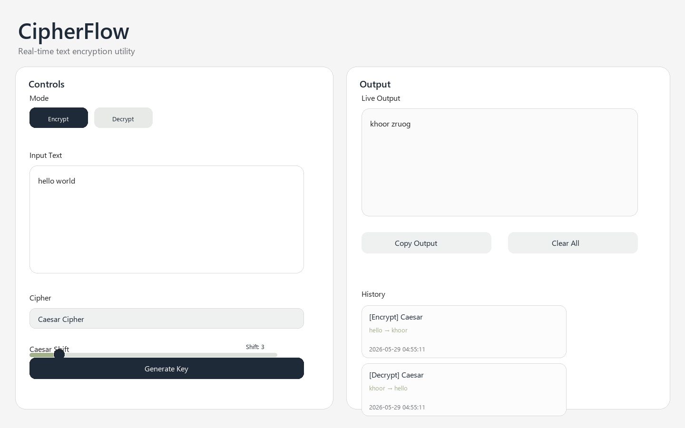
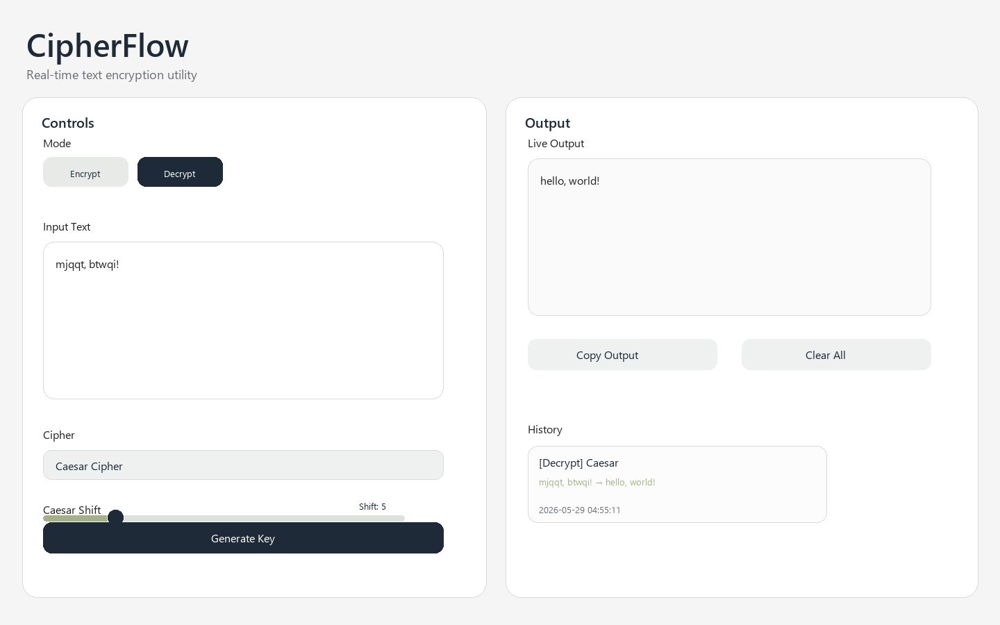
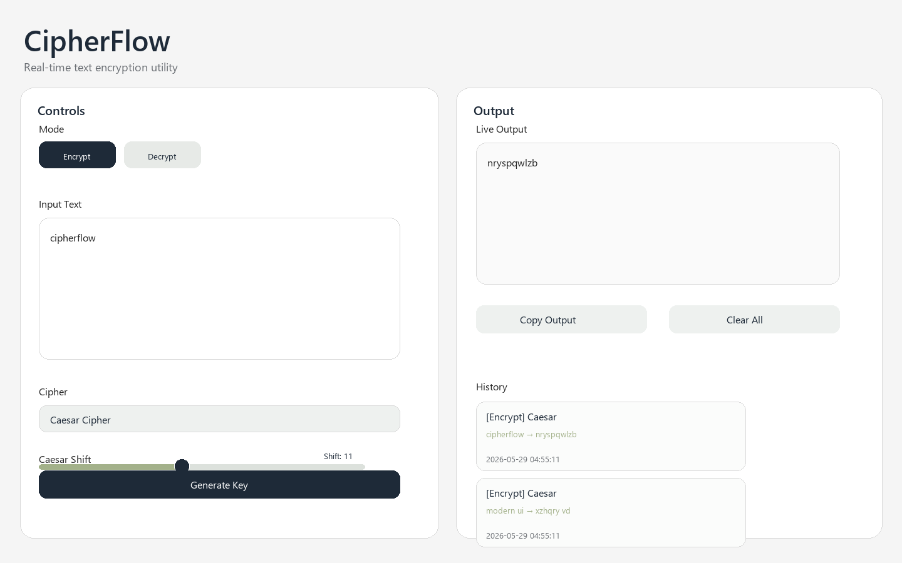
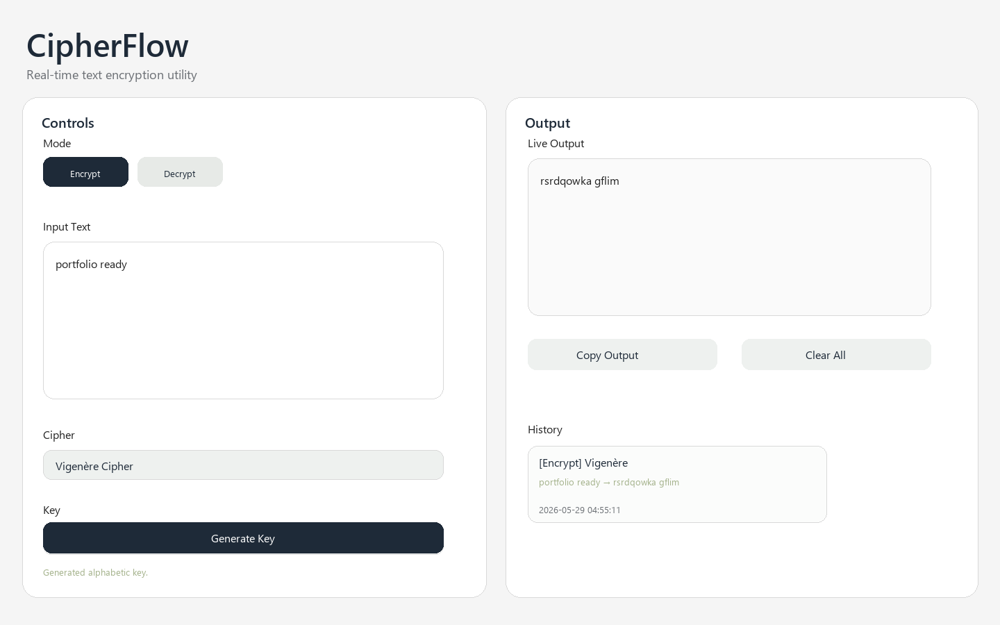
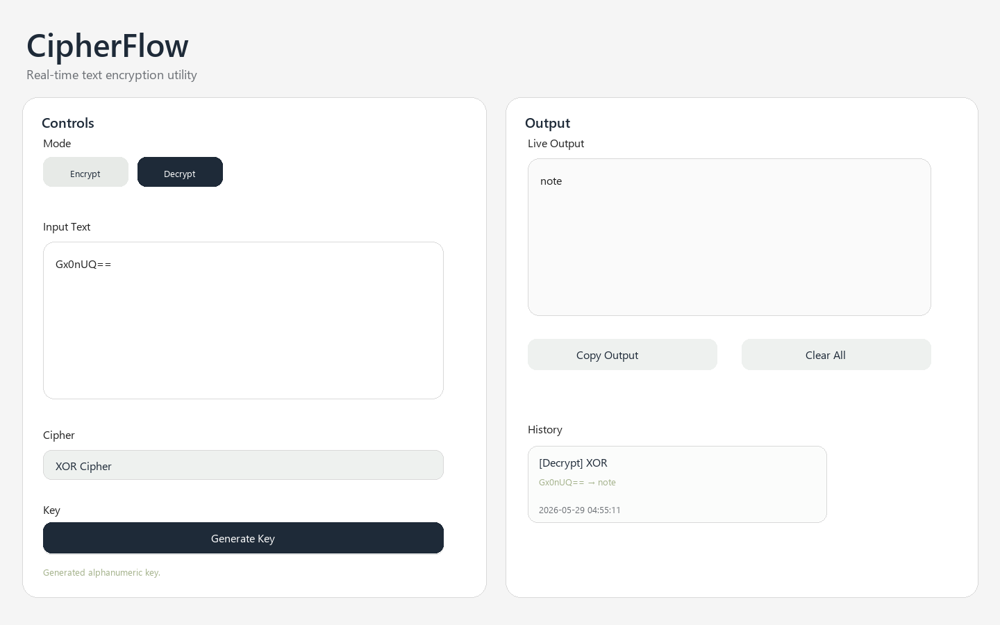

# CipherFlow

CipherFlow is a modern desktop encryption and decryption utility built with Python and CustomTkinter. It focuses on a calm, practical interface for quick text transformation, key generation, and lightweight history tracking.

## Features

- Real-time encryption and decryption
- Caesar, Vigenère, and XOR ciphers
- Mode switching between Encrypt and Decrypt
- Dynamic controls that change with the selected cipher
- Random key generation
- Clipboard copying
- Last 5 operations saved to JSON history
- Clean, minimal desktop UI

## Screenshots








## Installation

1. Install Python 3.12 or newer.
2. Install the dependencies:

```bash
pip install -r requirements.txt
```

## Usage

Run the application from the project root:

```bash
python main.py
```

Type text into the input field and CipherFlow updates the result instantly. Choose a cipher, set or generate a key, and switch between Encrypt and Decrypt modes without submitting a form.

## Technologies Used

- Python 3.12+
- CustomTkinter
- JSON
- pyperclip

## Project Structure

```text
CipherFlow/
├── assets/
├── core/
├── ui/
├── utils/
├── data/
├── README.md
├── requirements.txt
└── main.py
```

## Future Improvements

- Save and restore the last used settings
- Add more cipher algorithms
- Export history to CSV or JSON
- Search and filter history entries
- Add optional dark mode themes
